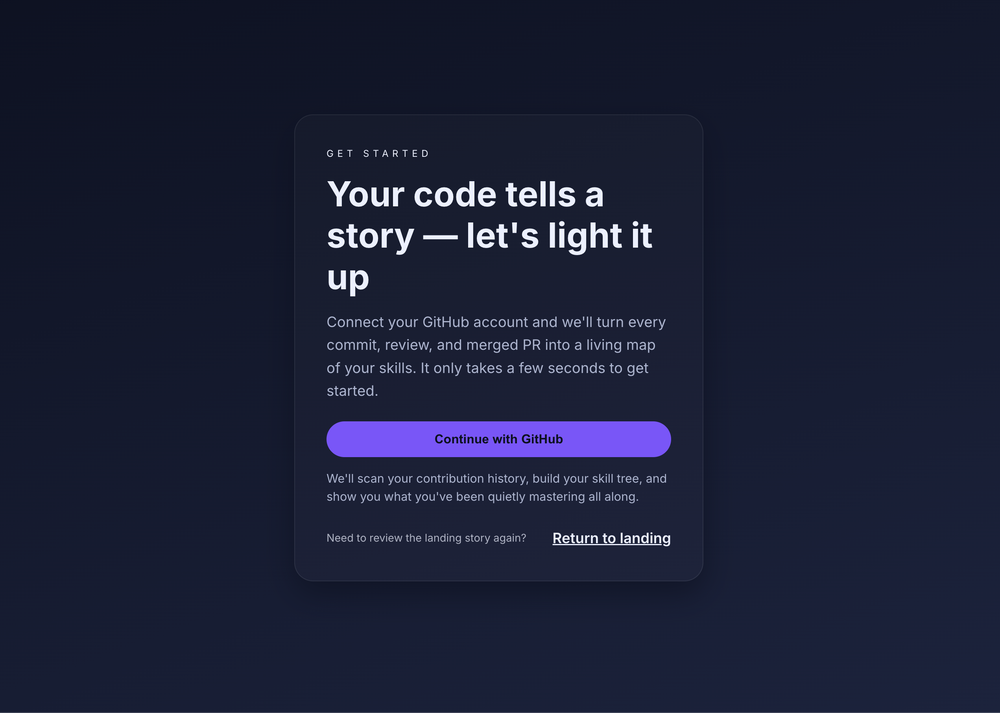
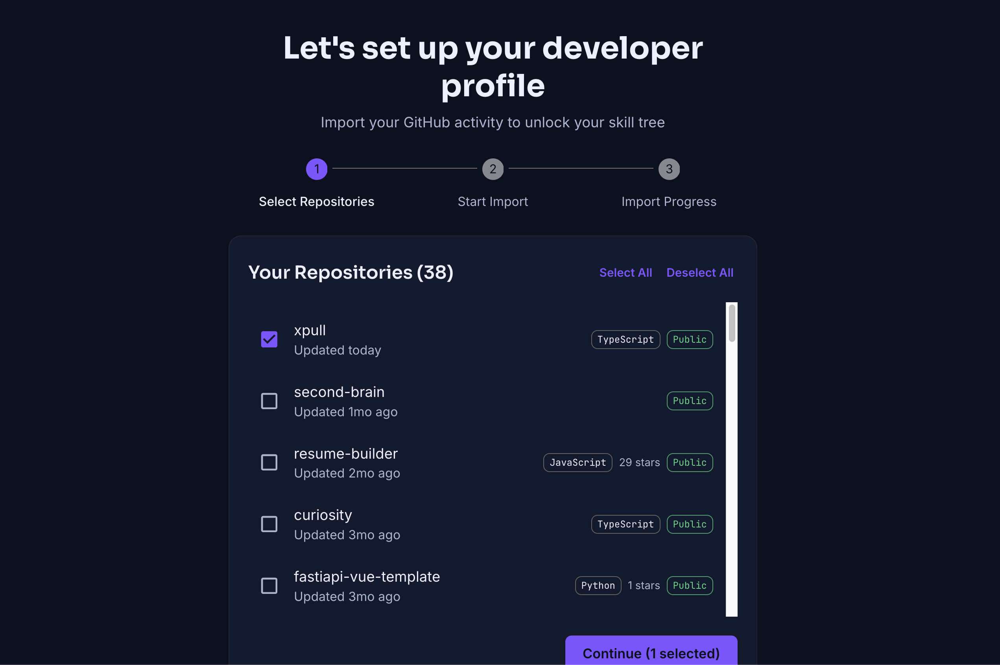
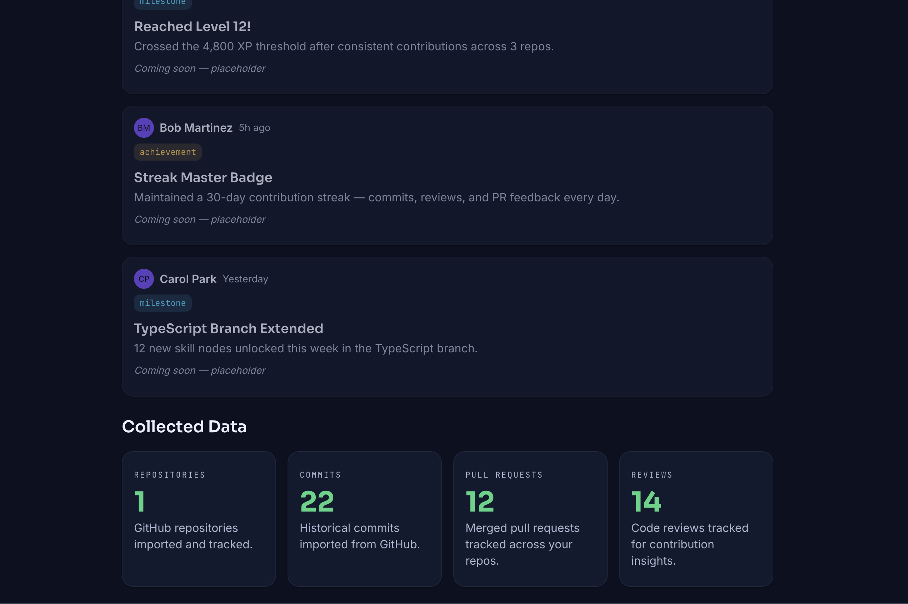
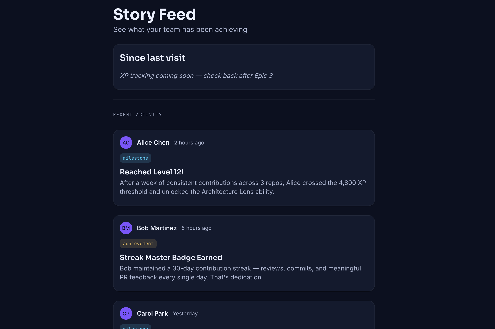
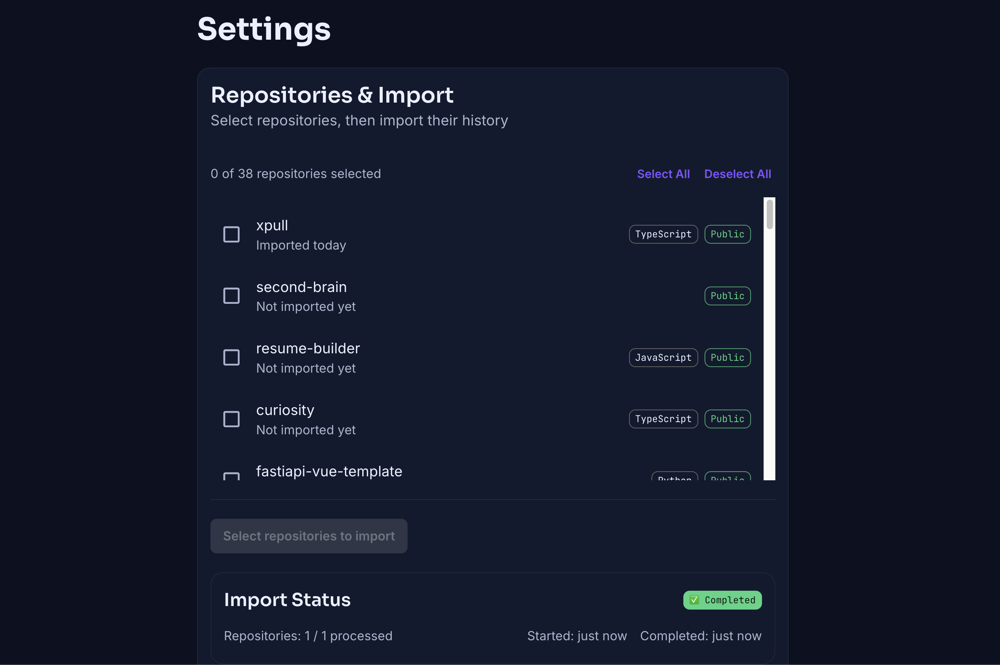

# xpull

**xpull** is a web platform that gamifies the developer experience using Git data. Developers connect their GitHub account and have their real-world coding activity — commits, pull requests, code reviews — turned into a progression system with XP, levels, skill trees, and social features. It’s a positive, anti-hustle layer on top of the work developers already do.

---

## Screenshots








## Features


| Feature                                                             | Status                        |
| ------------------------------------------------------------------- | ----------------------------- |
| GitHub OAuth sign-in                                                | ✅ Implemented                 |
| Onboarding wizard (repo selection + historical import)              | ✅ Implemented                 |
| Dashboard — identity, collected data (repos, commits, PRs, reviews) | ✅ Implemented                 |
| Settings — repository selection, import jobs, disconnect GitHub     | ✅ Implemented                 |
| Story Feed page (layout + “What Changed” panel)                     | ✅ Implemented                 |
| GitHub webhook ingestion (incremental sync)                         | ✅ Implemented                 |
| Level & league                                                      | ⏳ Placeholder badges only     |
| XP tracking                                                         | ❌ Not implemented (Epic 3)    |
| Skill trees                                                         | ❌ Not built; copy only        |
| Story Feed "Recent Activity"                                        | ⏳ Mock data                   |
| Dashboard "Team Activity"                                           | ⏳ Hardcoded placeholder cards |
| Quest / weekly cards                                                | ⏳ Placeholder                 |
| AI avatars                                                          | ❌ Not implemented             |
| Public profile & OG sharing                                         | ❌ Not implemented             |
| Pulls (social appreciation)                                         | ❌ Not implemented             |


---

## Local setup (Docker Compose)

### Prerequisites

- [Docker](https://docs.docker.com/get-docker/) and Docker Compose
- [pnpm](https://pnpm.io/) (optional; only if you run the app outside Docker)

### 1. Clone and configure environment

```bash
git clone <repo-url>
cd xpull
cp .env.example .env
```

Edit `.env` and set at least:

- `**AUTH_SECRET**` — any random string (e.g. `openssl rand -base64 32`)
- `**AUTH_GITHUB_ID**` and `**AUTH_GITHUB_SECRET**` — from [GitHub OAuth Apps](https://github.com/settings/developers) (use `http://localhost:3000` as callback URL)
- `**NEXTAUTH_URL**` — leave as `http://localhost:3000` for local dev

Optional for webhooks: set `**GITHUB_WEBHOOK_SECRET**` if you want to receive GitHub webhooks locally.

### 2. Start the stack

```bash
docker compose up --build
```

This starts:

- **PostgreSQL** on `localhost:5432` (user: `xpull`, password: `xpull_dev`, DB: `xpull_dev`)
- **Web app** (Next.js) on [http://localhost:3000](http://localhost:3000)

Migrations run automatically on startup. Open the app in the browser and sign in with GitHub.

### 3. Stop

```bash
docker compose down
```

Data is kept in a Docker volume; use `docker compose down -v` to remove it.