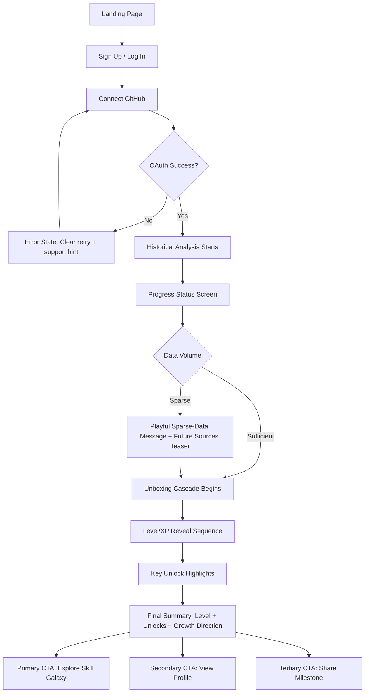
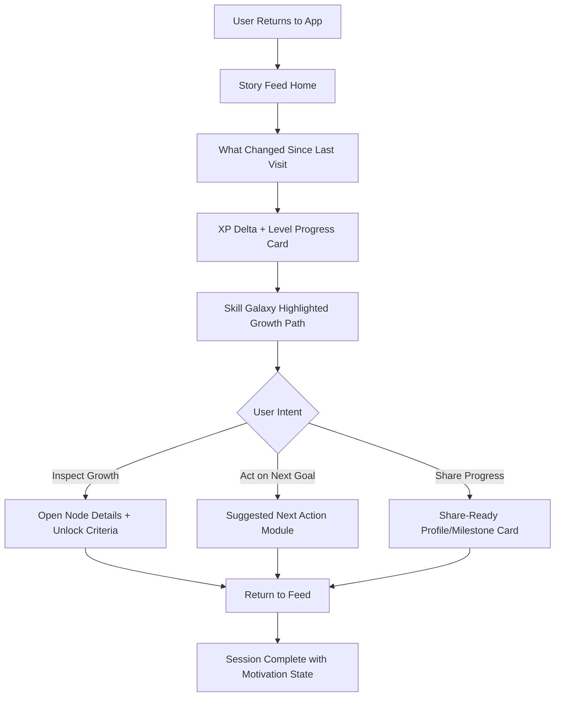
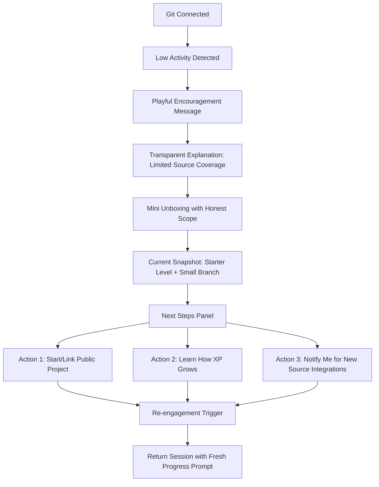

# UX Design Specification xpull

**Author:** Gianfranco
**Date:** 2026-02-17

---

<!-- UX design content will be appended sequentially through collaborative workflow steps -->

## Executive Summary

### Project Vision

xpull is designed to make developer growth visible, emotional, and motivating by transforming real Git activity into a living RPG-like identity. The UX vision centers on a high-impact first session that surprises users with what they have already accomplished and motivates them to keep growing. The experience should feel rewarding without pressure, social without toxicity, and personal without surveillance.

The product's UX signature is The Unboxing: a fast, cinematic onboarding sequence that reveals levels, skill branches, and achievements in a way that turns historical work into immediate emotional value. From there, users should feel continuous momentum through clear progression cues, meaningful milestones, and profile elements worth sharing.

### Target Users

Primary users include professional developers, beginner developers, and passion/side-project developers who want to see and feel their progress over time. While their experience levels differ, they share a common need: recognition of real work that is usually invisible.

Secondary users include engineering managers as organizational adopters, but only through opt-in and aggregate insights. Their needs should never compromise the developer-first UX. The design must also support sparse-history users with encouraging framing so low initial data feels like a beginning, not a failure.

### Key Design Challenges

Balancing delight and clarity in The Unboxing is a core challenge: the flow must be emotionally strong (surprise + motivation) while still being understandable, fast, and skippable.

Achieving near-desktop parity on mobile is another major challenge, especially for complex visual interactions like skill tree exploration and onboarding animations. Core flows cannot feel like mobile compromises.

Designing all three critical flows at a high quality simultaneously (Unboxing, skill tree exploration, and profile sharing) requires consistent progression language, interaction patterns, and visual hierarchy so the product feels like one coherent RPG system rather than separate features.

### Design Opportunities

A playful RPG-inspired UI language can create strong product identity and memorability while making progression intuitive. This is an opportunity to differentiate xpull emotionally from static developer tools.

The combination of progression visibility and positive-only social mechanics creates an opportunity to build a safer, more encouraging developer experience that still feels engaging and social.

Near-equal mobile and desktop quality opens a strong sharing loop opportunity: users can discover, explore, and share profiles fluidly across devices, increasing retention and organic growth.

## Core User Experience

### Defining Experience

The core xpull experience is a progression-first loop where users repeatedly return to check new XP updates and track visible profile growth. The product should make progress legible at a glance and emotionally rewarding in seconds, reinforcing motivation without pressure.

The single make-or-break interaction is The Unboxing flow. If Unboxing lands, users immediately understand the product's value and feel emotionally connected to their developer journey. If it feels confusing, slow, or underwhelming, trust and momentum are lost early.

### Platform Strategy

xpull will be delivered as a responsive web application (no native mobile app in MVP), with near-equal quality across desktop and mobile for all critical flows.

Primary interaction models include mouse/keyboard on desktop and touch on mobile, with design patterns that preserve feature parity rather than reducing mobile to a secondary experience. Offline functionality is not required for MVP, so the UX should optimize for connected, real-time progression experiences.

### Effortless Interactions

Git activity syncing should happen automatically in the background, with no manual steps required from users after initial connection.

XP and level updates should also feel automatic and immediate from the user perspective, with clear but lightweight feedback that progress has been captured.

The overall interaction goal is "zero-friction progression visibility": users open xpull and instantly understand what changed, why it matters, and what they can do next.

### Critical Success Moments

The most important success moment is the end of The Unboxing, where users see the full result of their historical effort and feel both surprise and motivation.

First-time user success depends on three outcomes in sequence: a smooth data connection, a compelling Unboxing reveal, and immediate clarity on progression state (XP, level, and growth direction).

The flow that cannot fail is Unboxing completion quality - pacing, clarity, and emotional payoff must all work together to create a memorable "this is better" moment.

### Experience Principles

Design for instant progression clarity: every session should quickly answer what changed and where growth is happening.

Make motivation feel earned, not forced: celebrate real work through meaningful feedback without anxiety mechanics or pressure loops.

Preserve cross-device quality: critical flows must feel consistent and high quality on both desktop and mobile web.

Treat Unboxing as the emotional engine: prioritize polish, clarity, and delight in onboarding because it defines first trust and long-term engagement.

## Desired Emotional Response

### Primary Emotional Goals

The primary emotional goal of xpull is inspiration. Users should feel energized by their own growth and excited about what they can become, not pressured by external competition.

A successful emotional outcome is: "I feel inspired when I use xpull." The experience should consistently transform invisible effort into visible progress and renewed motivation.

### Emotional Journey Mapping

At discovery, users should feel curiosity and intrigue, with a clear sense that xpull offers something meaningfully different from static developer profiles.

During onboarding (The Unboxing), users should feel surprise, momentum, and then inspiration as their history is revealed. The end of Unboxing is the key emotional conversion point where "this is better" must become unmistakable.

After completing key actions, users should feel motivated and proud of real progress. On return sessions, the emotional target remains consistent: users should feel inspired again, with fresh reasons to continue.

When things go wrong (low data, sync delays, incomplete updates), the product should preserve emotional safety through highly playful, encouraging communication that reduces frustration without hiding reality.

### Micro-Emotions

Most critical micro-emotions for xpull are:

- Confidence over confusion: users should always understand what changed and why.
- Trust over skepticism: progression should feel credible and grounded in real activity.
- Excitement without anxiety: momentum should feel energizing, never stressful.
- Accomplishment over frustration: every session should surface meaningful progress.
- Delight over flat satisfaction: key moments, especially Unboxing completion, should feel memorable.

### Design Implications

Inspiration -> emphasize visible growth storytelling, before/after progression cues, and forward-looking prompts that reinforce potential.

Curiosity and interest -> design exploration paths that invite users to inspect skill branches, unlock paths, and progression context without cognitive overload.

Trust and confidence -> use clear progression logic, transparent status feedback, and deterministic interaction outcomes that feel reliable.

Emotions to avoid (anxiety, pressure, confusion) -> avoid urgency mechanics, avoid ambiguous progression states, and remove unnecessary friction in core flows.

Underwhelming risk mitigation -> prioritize pacing, polish, and payoff in Unboxing completion, ensuring strong emotional climax and immediate post-Unboxing clarity.

### Emotional Design Principles

Design every core flow to renew inspiration, not just deliver information.

Use playful energy as emotional support, especially in edge cases, while preserving clarity and trust.

Make progression emotionally legible: users should feel what changed before they need to analyze it.

Protect users from pressure-based mechanics; motivation must feel earned, voluntary, and sustainable.

## UX Pattern Analysis & Inspiration

### Inspiring Products Analysis

**Strava**
- Solves personal progression tracking elegantly with clear activity summaries and momentum loops.
- Keeps users returning through visible progress, periodic goals, and social proof without requiring complex navigation.
- UX lesson for xpull: make progression instantly legible on entry and tie return behavior to meaningful personal growth cues.

**Duolingo**
- Delivers highly effective onboarding by reducing early cognitive load and using playful, guided progression.
- Uses micro-feedback, celebration moments, and clear next actions to sustain motivation.
- UX lesson for xpull: structure Unboxing and early sessions as a guided, high-confidence sequence with strong emotional payoff.

**GitHub**
- Provides trusted activity signals and familiar developer mental models around contributions, repositories, and profile identity.
- Strength lies in credibility and utility, but emotional progression is limited.
- UX lesson for xpull: maintain trust, clarity, and data credibility while adding an inspirational, gamified layer.

### Transferable UX Patterns

**Navigation Patterns**
- "Progress-at-a-glance" entry surface (inspired by Strava) to show latest XP changes and profile growth immediately.
- Clear hierarchy from summary -> detail (inspired by GitHub) for skill tree exploration and profile depth.

**Interaction Patterns**
- Guided first-run choreography (inspired by Duolingo) to make Unboxing clear, paced, and confidence-building.
- Lightweight, frequent reinforcement loops (inspired by Strava + Duolingo) to encourage return sessions without pressure mechanics.

**Visual Patterns**
- Playful but structured progression visuals (Duolingo influence) adapted to xpull's RPG identity.
- High-information trust cues (GitHub influence) to ensure progression feels credible and grounded in real activity.

### Anti-Patterns to Avoid

- Pressure streak mechanics that create anxiety or guilt-driven engagement.
- Vanity leaderboards and comparison-first patterns that conflict with self-progression philosophy.
- Notification spam and noisy dashboards that dilute meaningful progress signals.
- Over-gamified interfaces that obscure clarity and make progression feel arbitrary.
- Ambiguous progression states that lead to confusion about what changed and why.

### Design Inspiration Strategy

**What to Adopt**
- From Strava: clear return-loop framing around personal progress and momentum.
- From Duolingo: guided onboarding pacing, micro-celebrations, and next-best-action clarity.
- From GitHub: trusted activity representation and strong information architecture.

**What to Adapt**
- Adapt Strava-style progress summaries to developer-specific XP and skill tree growth.
- Adapt Duolingo-style playful feedback to an anti-pressure, developer-first tone.
- Adapt GitHub-like profile trust signals to support RPG-style identity without losing credibility.

**What to Avoid**
- Avoid Duolingo-like pressure dynamics (streak stress) that conflict with xpull's anti-hustle values.
- Avoid competitive ranking patterns that undermine inspiration and psychological safety.
- Avoid cluttered or overly abstract gamification that reduces clarity in core progression flows.

## Design System Foundation

### 1.1 Design System Choice

xpull will use a themeable design system approach with MUI as the foundational component framework.

This choice provides a strong balance between development speed and brand uniqueness, enabling rapid MVP delivery while still supporting a distinct playful RPG-inspired visual identity.

### Rationale for Selection

- Balance of speed and uniqueness: MUI accelerates implementation with production-ready components, while theming allows xpull to avoid a generic look.
- Solo-builder efficiency: A mature, well-documented system reduces implementation risk and decision fatigue during MVP development.
- Cross-device consistency: MUI supports responsive behavior and component consistency across desktop and mobile web, aligning with near-parity UX goals.
- Accessibility baseline: Built-in accessibility patterns reduce rework and support quality standards from the start.
- Scalable foundation: The system can evolve from MVP to richer gamified interactions without replacing the core UI foundation.

### Implementation Approach

Adopt MUI for all core structural and form components in MVP (navigation, cards, dialogs, inputs, feedback states), while layering xpull-specific progression and RPG interaction patterns as custom components.

Establish a token-first implementation flow:
1. Define brand tokens (color, typography, spacing, radius, elevation, motion).
2. Apply tokens through MUI theme configuration.
3. Build reusable xpull primitives (progress cards, XP indicators, badge chips, status messaging).
4. Create custom feature components for signature experiences (Unboxing sequences, skill tree UI shells, progression summaries).

Use MUI defaults where they improve speed, and selectively override components where emotional tone or product identity requires differentiation.

### Customization Strategy

- Visual identity layer: Implement a custom theme that expresses playful RPG energy without sacrificing readability or trust.
- Progression language system: Standardize visual cues for XP gain, level changes, unlock states, and growth direction.
- Emotion-aware feedback: Define reusable feedback patterns for celebration, neutral updates, and edge-case handling (especially playful messaging for sparse data or sync delays).
- Interaction consistency: Keep motion, hover/focus states, and CTA hierarchy consistent across onboarding, profile, and progression flows.
- Extensibility: Separate design tokens and custom components so future expansion (rings, quests, social features) can reuse established patterns.

## 2. Core User Experience

### 2.1 Defining Experience

The defining xpull experience is: "Connect your Git history and instantly watch your developer identity unfold through The Unboxing."

If xpull nails one thing, it is the Unboxing sequence that transforms invisible past work into visible progression (XP, levels, skill branches, achievements) with a clear emotional arc: surprise -> recognition -> inspiration.

This is the interaction users should describe to friends because it is both uniquely memorable and directly tied to xpull's value proposition.

### 2.2 User Mental Model

Before xpull, users typically measure growth through fragmented proxies: GitHub contribution graphs, occasional PR feedback, memory of shipped work, and informal self-judgment.

Their baseline expectations are:
- Growth tracking is incomplete and often under-rewarding.
- Private/professional work is mostly invisible.
- Existing tools show activity but not identity-level progression.

Likely confusion points in the defining interaction:
- "Is this progression accurate?"
- "Why did I land at this level?"
- "What should I do next to grow?"

The UX must resolve these quickly through transparent progress cues, concise explanations, and immediate next-step guidance.

### 2.3 Success Criteria

The defining interaction is successful when users feel "this just works" within seconds and complete the sequence with clear motivation to return.

Core success indicators:
- Users reach a first "wow" moment quickly (first meaningful reveal appears fast and feels credible).
- Users complete Unboxing without confusion and can explain their resulting profile state.
- Users leave onboarding with a clear next action (explore tree, check progression, share profile).

Operational UX targets for MVP:
- Strong Unboxing completion rate aligned with activation goals.
- Fast time-to-first-value (early emotional payoff before full sequence ends).
- End-to-end pacing that feels cinematic but never slow, with skip/fast-forward control.

### 2.4 Novel UX Patterns

xpull uses a hybrid pattern strategy:
- Familiar foundations: card-based progression, profile hierarchy, clear status/feedback, known web interaction conventions.
- Novel combination: historical replay + cascading progression + RPG identity reveal in one onboarding arc.

This means users do not need to learn a completely new interaction language, but still experience something distinctive.

Teaching strategy for novel aspects:
- Progressive reveal and concise narration during Unboxing.
- Immediate mapping between revealed data and trusted Git activity.
- Plain-language explanations for "why this level / why this unlock."

### 2.5 Experience Mechanics

**1. Initiation**
- User signs in and connects GitHub.
- System signals "analysis in progress" with clear, confident status messaging.
- Entry point invites the user into Unboxing as a one-time signature reveal.

**2. Interaction**
- Unboxing runs as an auto-paced cascade (levels, XP, unlocks) with user controls to pause/skip/fast-forward.
- Key moments are grouped to avoid noise and preserve emotional build-up.
- User can inspect selected reveals (e.g., major unlocks) without breaking flow.

**3. Feedback**
- Each progression event provides immediate visual confirmation and plain-language meaning.
- Trust cues explain that progression comes from real activity history.
- If data is sparse or delayed, messaging stays playful and encouraging while remaining transparent.

**4. Completion**
- Flow ends on a strong summary state: current level, key unlocks, and visible growth direction.
- User sees explicit "what now" actions: explore skill tree, review progression details, share profile.
- Completion should leave users inspired and oriented, not overwhelmed.

## Visual Design Foundation

### Color System

xpull will use a dark-first "Neo Arcade" palette designed to balance credibility (developer tooling context) with playful RPG progression energy.

**Core Palette**
- Primary: Electric Violet `#7C4DFF`
- Secondary: Cyan Glow `#00D1FF`
- Accent (XP/Rewards): Gold `#FFC857`
- Success: Mint `#32D583`
- Warning: Amber `#F5A524`
- Error: Coral Red `#FF5A7A`
- Background: Deep Navy `#0B1020`
- Surface: `#121A2E`
- Surface Elevated: `#1A2440`
- Text Primary: `#EAF0FF`
- Text Secondary: `#A9B4D0`

**Semantic Mapping**
- Primary actions and key CTAs -> Electric Violet
- Secondary actions and interactive highlights -> Cyan Glow
- XP gains, unlocks, and reward moments -> Gold
- Positive completion and healthy states -> Mint
- Caution and recoverable issues -> Amber
- Errors and destructive states -> Coral Red

**Emotional Fit**
This palette supports inspirational and playful emotional goals while avoiding pressure-heavy visual language. Progress events should feel energizing and celebratory without becoming visually noisy.

### Typography System

Typography will combine expressive headings with highly readable UI text for a product that is both gameful and trustworthy.

**Typeface Stack**
- Heading/Display: Sora
- Body/UI: Inter
- Code/Meta labels: JetBrains Mono

**Type Scale**
- 12px (micro labels)
- 14px (supporting UI text)
- 16px (base body)
- 20px (section headers)
- 24px (major section titles)
- 32px (page headings)
- 40px (hero/Unboxing moments)

**Hierarchy Strategy**
- Sora is reserved for strong moments (Unboxing milestones, level reveals, section anchors).
- Inter carries all high-frequency reading and form interaction.
- JetBrains Mono is used selectively for developer-flavored metadata (XP deltas, activity tags, technical labels).

### Spacing & Layout Foundation

xpull will use a systemized spacing and layout structure that keeps complex progression data clear while preserving visual excitement.

**Spacing System**
- Base spacing unit: 8px
- Micro-adjustment unit: 4px
- Radius scale: 8px / 12px / 16px / 20px

**Grid & Breakpoints**
- Desktop: 12-column grid
- Tablet: 8-column grid
- Mobile: 4-column grid
- Layout behavior emphasizes responsive parity so core flows remain strong on mobile web.

**Layout Principles**
- Progress-first hierarchy: key progression signals appear above secondary detail.
- Medium-airy density: enough whitespace for clarity without feeling sparse.
- Consistent interaction zones: predictable spacing for controls, cards, and status elements across screens.

### Accessibility Considerations

The visual foundation must preserve excitement without sacrificing usability.

- WCAG 2.1 AA contrast compliance across all core text and controls.
- Status communication uses color + iconography/text (never color alone).
- Minimum readable body size on mobile defaults to 16px.
- Motion effects include `prefers-reduced-motion` alternatives for Unboxing and progression animations.
- Focus states are high-visibility and consistent across interactive components.
- Error/warning/success states remain semantically distinct under different vision conditions.

## Design Direction Decision

### Design Directions Explored

Six concrete visual directions were explored in the HTML showcase: progression-first dashboard hierarchy, narrative feed emphasis, immersive RPG expression, utility-minimal trust presentation, mobile-first stacking, and a hybrid recommendation model.

The final comparison focused on alignment with xpull's core goals: inspirational emotional response, clear progression legibility, anti-pressure UX, and near-parity mobile/desktop quality.

### Chosen Direction

The chosen direction is Direction 2 (Story Feed) as the base, combined with selected signature elements from Direction 3 (RPG Chamber).

**Base Structure (Direction 2)**
- Narrative-first progression feed
- Milestone storytelling cards
- Clear "what changed" and "what next" sequencing
- Strong emotional continuity across sessions

**Adopted Signature Elements (Direction 3)**
- Avatar + Level Crest + League Ring in the top identity area
- Skill Galaxy View as the primary skill visualization mode

This creates a storytelling-led product shell with a distinctive RPG identity layer.

### Design Rationale

Direction 2 best supports inspiration and return motivation by making each session feel like an evolving story of growth, not just a static dashboard check.

Adding Direction 3's identity and skill visualization elements introduces the memorable "specialness" needed for xpull differentiation while preserving the narrative clarity of the base layout.

This combination balances:
- Emotional impact (story + identity expression)
- Progression clarity (structured feed hierarchy)
- Brand uniqueness (RPG signals without over-gamification)
- Trust and usability (clear cards, explicit sequencing, interpretable progression states)

### Implementation Approach

Implement Direction 2 as the structural framework first:
1. Build narrative feed shell with milestone cards, status context, and next-action modules.
2. Integrate top identity module (Avatar + Level Crest + League Ring) as a persistent hero element.
3. Implement Skill Galaxy View as a core visualization component with readable fallback states.
4. Preserve responsive parity by stacking story modules and identity blocks cleanly on mobile.
5. Keep interaction density moderate, with strict readability and trust cues to avoid visual overload.

Design system execution should prioritize reusable feed and identity primitives so future features (quests, rings, social moments) inherit the same visual and interaction language.

## User Journey Flows

### Journey 1 - Unboxing Activation Flow (Alex Path)

Goal: Turn signup into a high-confidence, high-emotion first session where the user understands progression and feels inspired to return.

Design notes:
- Keep trust cues visible during analysis and reveal ("based on real Git activity").
- Ensure first wow moment appears early in the cascade.
- Provide skip/fast-forward without losing understanding.

### Journey 2 - Weekly Progress Check Flow (Core Return Loop)

Goal: Make repeat visits instantly valuable by showing what changed, why it matters, and what to do next.

Design notes:
- "What changed" must always be above the fold.
- Maintain one clear next-action suggestion to reduce decision fatigue.
- Keep emotional tone motivational, not pressure-based.

### Journey 3 - Sparse Data Recovery Flow (Sam Edge Case)

Goal: Prevent discouragement when available data is limited and convert disappointment into forward momentum.

Design notes:
- Keep messaging playful and respectful, never apologetic or dismissive.
- Be transparent about why output is limited.
- Always provide immediate constructive actions.

### Journey Patterns

**Navigation Patterns**
- Story-feed entry with progression-first top modules.
- Summary -> detail drill-down for skill growth and unlock logic.
- Persistent identity anchor (Avatar + Level Crest + League Ring) as orientation point.

**Decision Patterns**
- Single primary CTA at key moments (especially post-Unboxing and return sessions).
- Explicit branch choices for inspect / act / share to reduce ambiguity.
- Progressive disclosure for complexity (details available, not forced upfront).

**Feedback Patterns**
- Immediate "what changed" feedback at session start.
- Trust signals tied to real Git-derived events.
- Playful but transparent fallback states for sparse data and sync delays.

### Flow Optimization Principles

- Minimize time-to-value in every journey.
- Keep cognitive load low with one dominant task per screen.
- Prioritize motivational clarity over feature density.
- Make recovery paths first-class (not hidden).
- Preserve consistency of progression language across all flows.
- Ensure mobile parity by designing stacked, touch-ready equivalents for all key states.

## Component Strategy

### Design System Components

Using MUI as the foundation, xpull will rely on proven base components for speed, accessibility, and consistency.

**Primary MUI Foundation Components**
- Layout: Container, Grid, Stack, Box, Paper
- Navigation: AppBar, Tabs, Drawer, BottomNavigation
- Inputs: Button, IconButton, TextField, Select, Switch
- Feedback: Snackbar, Alert, LinearProgress, CircularProgress, Tooltip
- Data Display: Card, Chip, Badge, Avatar, List, Divider
- Overlays: Dialog, Menu, Popover, Modal

These components cover structural UI, forms, navigation, and common feedback patterns. They should remain lightly themed unless xpull-specific behavior requires deeper customization.

### Custom Components

### IdentityHero

**Purpose:** Persistent identity anchor displaying Avatar + Level Crest + League Ring at the top of core flows.  
**Usage:** Story Feed header, profile top section, post-Unboxing summary.  
**Anatomy:** Avatar frame, level badge, league ring visualization, XP-to-next marker.  
**States:** loading, default, hover (desktop), compact (mobile), error fallback image.  
**Variants:** full hero, compact header, profile emphasis.  
**Accessibility:** semantic heading grouping, alt text for avatar, progress aria for XP ring.  
**Content Guidelines:** highlight one primary identity signal at a time to avoid clutter.  
**Interaction Behavior:** tap/click opens progression summary drawer.

### StoryMilestoneCard

**Purpose:** Turn progression events into narrative cards that reinforce inspiration and continuity.  
**Usage:** Story Feed entries for unlocks, level-ups, XP milestones, behavioral highlights.  
**Anatomy:** event title, contextual "why", timestamp, optional action CTA.  
**States:** unread, read, expanded, collapsed, loading skeleton.  
**Variants:** milestone, achievement, suggestion, system-update.  
**Accessibility:** card announced as feed item; keyboard-expand behavior.  
**Content Guidelines:** lead with user-facing meaning before technical details.  
**Interaction Behavior:** expand for supporting details and trust explanation.

### WhatChangedPanel

**Purpose:** Immediate "since last visit" snapshot to reduce cognitive load at session start.  
**Usage:** Top section on return sessions.  
**Anatomy:** XP delta, level movement, unlock count, key highlight sentence.  
**States:** no-change, positive change, partial data sync pending.  
**Variants:** desktop horizontal summary, mobile stacked summary.  
**Accessibility:** concise summary text with numeric values announced.  
**Content Guidelines:** max 3 key signals; avoid dense metric walls.  
**Interaction Behavior:** links to detailed breakdown sections.

### SkillGalaxyView

**Purpose:** Primary visual representation of skill growth with RPG identity flavor.  
**Usage:** Core progression exploration from feed and profile.  
**Anatomy:** branch nodes, connection paths, active highlight, unlock roadmap panel.  
**States:** zoomed, panned, focused-node, reduced-motion mode, empty/sparse branch.  
**Variants:** interactive full view, mini-preview card, read-only share snapshot.  
**Accessibility:** keyboard navigable node list alternative; textual node summaries.  
**Content Guidelines:** emphasize next reachable nodes and recent growth first.  
**Interaction Behavior:** select node to open detail panel with unlock criteria and evidence.

### NextActionModule

**Purpose:** Provide a single clear action that advances growth without pressure.  
**Usage:** End of Unboxing, return session feed, sparse recovery flow.  
**Anatomy:** recommendation title, rationale, confidence/trust note, CTA button.  
**States:** actionable, dismissed, completed, unavailable due to missing data.  
**Variants:** growth action, exploration action, sharing action.  
**Accessibility:** actionable controls with clear labels and expected outcome text.  
**Content Guidelines:** one primary recommendation, optional secondary link only.  
**Interaction Behavior:** records completion/dismissal and updates suggestion logic.

### UnboxingCascadeController

**Purpose:** Orchestrate cinematic but controllable onboarding reveal.  
**Usage:** First-time onboarding and optional replay mode.  
**Anatomy:** sequence stage indicator, reveal viewport, skip/pause/fast-forward controls.  
**States:** analyzing, running, paused, skipped, completed, fallback reduced-motion.  
**Variants:** full first-run, condensed replay.  
**Accessibility:** reduced-motion mode, keyboard control parity, narration text fallback.  
**Content Guidelines:** reveal meaning along with spectacle ("what this means for you").  
**Interaction Behavior:** user control never breaks comprehension of final outcome.

### SparseRecoveryPanel

**Purpose:** Convert low-data disappointment into playful, constructive momentum.  
**Usage:** Sparse detection during or after onboarding.  
**Anatomy:** encouraging message, transparent cause, immediate next steps.  
**States:** sparse-confirmed, sync-pending, source-limited, recheck-ready.  
**Variants:** onboarding context, return-session reminder.  
**Accessibility:** clear explanatory text and explicit action labels.  
**Content Guidelines:** playful tone without minimizing user frustration.  
**Interaction Behavior:** actions trigger meaningful follow-ups (learn, connect, notify).

### Component Implementation Strategy

- Build all custom components on top of MUI primitives and theme tokens.
- Keep behavior contracts explicit (inputs, outputs, states) for each custom component.
- Standardize progression semantics (XP, unlock, level, trust evidence) across every component.
- Enforce accessibility at component-definition level, not as post-implementation patching.
- Align all motion and transitions with reduced-motion and performance constraints.
- Maintain mobile/desktop parity through variant rules rather than separate component systems.

### Implementation Roadmap

**Phase 1 - Core Components (MVP Critical Flows)**
1. `UnboxingCascadeController`
2. `IdentityHero`
3. `WhatChangedPanel`
4. `NextActionModule`

**Phase 2 - Core Progression Exploration**
5. `SkillGalaxyView` (interactive baseline)
6. `StoryMilestoneCard` (feed baseline templates)

**Phase 3 - Resilience & Experience Enhancements**
7. `SparseRecoveryPanel`
8. `SkillGalaxyView` advanced states (share snapshot, rich node overlays)
9. `StoryMilestoneCard` advanced narrative variants

**Phase 4 - Optimization & Scalability**
- Component instrumentation for UX analytics
- Variant hardening for future features (quests, rings, social feed expansion)
- Token and theming refinement based on real usage patterns

## UX Consistency Patterns

### Button Hierarchy

**Primary Actions**
- Use primary button style (Electric Violet) for one dominant action per screen.
- Typical use: "Explore Skill Galaxy", "Continue Unboxing", "Apply Next Action".
- Placement: right-aligned on desktop action groups, bottom-fixed or bottom-priority on mobile.

**Secondary Actions**
- Use outlined/tonal buttons for supporting actions.
- Typical use: "View Profile", "Learn More", "Dismiss".
- Must never visually compete with primary CTA.

**Tertiary/Text Actions**
- Use text buttons/inline links for low-risk utility actions.
- Typical use: "Skip for now", "Why this level?", "See details".

**Destructive Actions**
- Use coral-red destructive styling only for irreversible actions.
- Require explicit confirmation modal for account/data destructive operations.

**Behavior Rules**
- Exactly one primary CTA per major surface.
- Buttons show loading state with disabled interaction while request is in flight.
- Minimum tap target: 44x44 on mobile.

### Feedback Patterns

**Success**
- Use concise success toasts for lightweight confirmations (e.g., preference saved).
- Use inline success banners for major milestones (e.g., unlock achieved).
- Pair success color with icon/text, never color-only.

**Error**
- Use inline errors for field-level issues.
- Use top-level alert for blocking/system failures.
- Provide clear recovery action (retry, edit input, contact support path).

**Warning**
- Use warnings for recoverable risks (sync delayed, partial data).
- Tone should be calm and informative, not alarming.

**Informational**
- Use informational panels for "why" explanations (e.g., progression rationale).
- Keep copy short and evidence-based to support trust.

**Sparse/Edge Feedback**
- In sparse data states, use playful encouragement + transparent explanation + next-step CTA.
- Never hide constraints; frame them constructively.

### Form Patterns

**Input Structure**
- Labels always visible (no placeholder-only fields).
- Optional helper text below inputs for validation criteria.
- Group related fields with clear section titles.

**Validation**
- Prefer real-time validation for format (email, username).
- Use submit-time validation for cross-field logic.
- Error text must explain cause + fix in one sentence.

**Progressive Disclosure**
- Keep first-pass forms minimal (especially onboarding).
- Reveal advanced options only when user intent is explicit.

**State Handling**
- Disabled submit until required fields are valid.
- Preserve entered values after validation or server error.
- Show loading + success/failure states clearly after submit.

### Navigation Patterns

**Global Navigation**
- Story Feed is primary home.
- Top identity anchor (Avatar + Level Crest + League Ring) remains consistent.
- Desktop: top nav + contextual sub-navigation.
- Mobile: bottom navigation for core destinations.

**Hierarchy**
- Follow summary -> detail -> action progression consistently.
- "What changed" modules appear above fold on return sessions.

**Wayfinding**
- Highlight active nav state clearly.
- Use consistent page titles and section labels.
- Provide back/close behavior parity across modal and page contexts.

**Deep Interaction**
- Skill Galaxy opens detail panels without losing global orientation.
- Preserve user context on close (return to same scroll/selection state).

### Additional Patterns

**Modal & Overlay Patterns**
- Use modals for short, focused decisions only.
- Use side drawers/panels for rich contextual detail.
- Every overlay has clear close affordance and keyboard escape support.

**Empty States**
- Empty states must include:
  1) what this space is for,
  2) why it is empty now,
  3) one clear next action.
- Tone remains motivational and non-judgmental.

**Loading States**
- Use skeletons for content-heavy surfaces.
- Use staged loading for Unboxing analysis with trust-building status messages.
- Avoid blocking spinners when partial UI can render.

**Search & Filtering**
- Keep filters simple by default, advanced filters collapsible.
- Show active filter chips and one-click clear.
- Persist recent filters during session to reduce repetition.

**Cross-Cutting Accessibility Rules**
- Keyboard navigation supported for all critical interactions.
- Focus indicators always visible and high contrast.
- ARIA labels for dynamic progression visuals and interactive custom components.
- Reduced-motion alternatives for all major animations.

## Responsive Design & Accessibility

### Responsive Strategy

**Desktop (1024px+)**
- Use expanded layout density with multi-column composition for Story Feed + contextual detail panels.
- Keep IdentityHero persistent at the top with secondary contextual navigation.
- Allow side-by-side viewing for progression cards and Skill Galaxy details where space permits.

**Tablet (768px-1023px)**
- Use touch-optimized, reduced-density two-column layout where possible, with prioritized stacking for complex surfaces.
- Preserve key desktop affordances (identity anchor, what-changed summary) while simplifying simultaneous panel usage.
- Optimize interaction zones for touch and gesture-based exploration in Skill Galaxy.

**Mobile (320px-767px)**
- Use single-column, high-priority stacking with bottom navigation for core destinations.
- Keep "What Changed" and primary CTA above the fold on return sessions.
- Collapse non-critical detail into expandable modules; preserve parity for core actions (inspect, act, share).

**Cross-device principle**
- Functional parity for all critical journeys, with layout adaptation rather than feature removal.

### Breakpoint Strategy

- Mobile: 320-767px
- Tablet: 768-1023px
- Desktop: 1024px+
- Large desktop enhancement: 1440px+ for increased information density and multi-panel support

Implementation approach:
- Mobile-first CSS and component composition strategy.
- Use fluid spacing/typography scaling between breakpoints.
- Prefer relative units (`rem`, `%`, `vw`) and container-aware layouts.

### Accessibility Strategy

Target compliance: **WCAG 2.1 AA** across all core journeys and components.

Core requirements:
- Minimum contrast ratio of 4.5:1 for normal text and 3:1 for large text/UI controls.
- Full keyboard operability for navigation, forms, overlays, and Skill Galaxy alternatives.
- Screen reader support with semantic structure, ARIA labels, and descriptive status messaging.
- Minimum touch targets of 44x44 for actionable elements.
- Visible, high-contrast focus indicators in all interactive states.
- Reduced-motion alternatives for Unboxing and all animated progression interactions.
- Non-color-only status communication (color + icon + text).

### Testing Strategy

**Responsive testing**
- Validate core journeys on real mobile and tablet devices across iOS and Android browsers.
- Cross-browser checks on Chrome, Firefox, Safari, and Edge.
- Test under constrained networks for onboarding and return-session performance.

**Accessibility testing**
- Automated checks (axe/Lighthouse) in CI and during UI development.
- Keyboard-only testing for all critical paths.
- Screen reader validation with VoiceOver (macOS/iOS) and NVDA (Windows).
- Contrast and color-vision simulation testing for progression and status cues.

**User testing**
- Include users with varying accessibility needs for critical flow validation.
- Validate comprehension of Unboxing, sparse-data states, and next-action guidance.

### Implementation Guidelines

**Responsive development**
- Build mobile-first, then progressively enhance for tablet/desktop density.
- Use component variants instead of separate component systems per device.
- Keep primary actions anchored consistently across breakpoints.
- Prioritize content order by user intent: what changed -> what it means -> what to do next.

**Accessibility development**
- Use semantic HTML landmarks and heading hierarchy.
- Add ARIA roles/labels only where native semantics are insufficient.
- Ensure focus management for dialogs, drawers, and dynamic state changes.
- Provide text alternatives for visual progression constructs (especially Skill Galaxy).
- Maintain equivalent non-animated pathways for users who prefer reduced motion.
